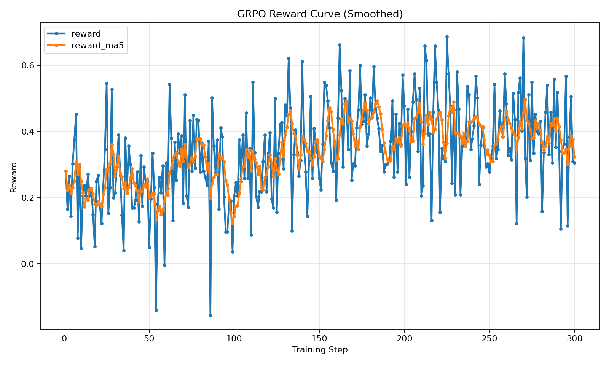
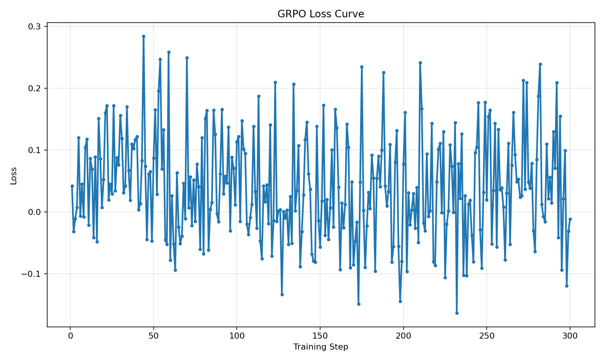
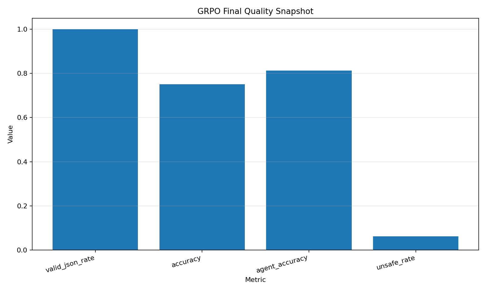
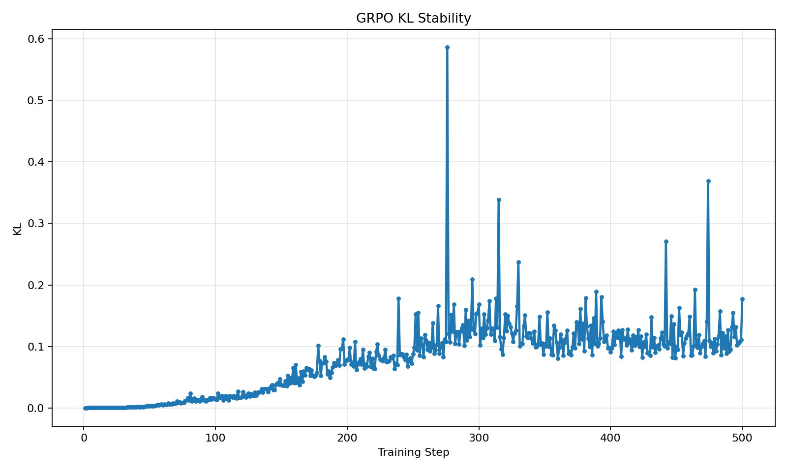
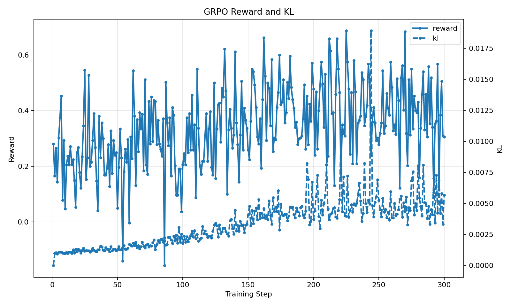

--- 
title: OpsSim-AI
emoji: 🚨
colorFrom: red
colorTo: gray
sdk: gradio
sdk_version: 5.0.0
app_file: app.py
pinned: false
tags:
  - openenv
  - reinforcement-learning
  - multi-agent
---

# OpsSim-AI: Teaching LLMs to Run a Production War Room

When a checkout system starts throwing 500 errors at 2 AM, the cause is rarely obvious. A Redis cache failure may be triggering payment timeouts, which leave stale database connections, which make it tempting to restart the wrong service too early — making everything worse.

Real incident response requires a team of specialists who each see only part of the picture, must communicate findings, coordinate actions in the right order, and resist the urge to take dangerous shortcuts.

**OpsSim-AI** is an environment that turns this kind of messy, multi-team incident into a structured training ground for LLM agents.

## Additional Resources

- 🔗 **GitHub:** [nithishgouds/Meta-X-OpenEnv-X-Pytorch-Hackathon](https://github.com/nithishgouds/Meta-X-OpenEnv-X-Pytorch-Hackathon)

- 📝 **Blog Post:** [Coming soon]

---

## Demo

🔗 **Hugging Face Space:** [Coming soon — link will be added here]

The demo lets you:

- Select a cascading failure scenario
- Watch the agent team diagnose and resolve the incident step by step
- See the 13-component reward breakdown at each step
- Compare agent decisions against the optimal recovery path
- View the war room's incident channel and communication flow

---

## The Problem

Large language models are good at answering questions when they can see all the information. Real operational incidents are nothing like that.

In a production outage:

- **No one sees the full picture.** The database team sees lock contention. The infra team sees pod restarts. The app team sees checkout errors. The actual root cause could be upstream of all of them.
- **Order matters.** Restarting a service before fixing the underlying cause just restarts the failure loop.
- **Wrong actions make things worse.** Flushing DNS when the problem is a database deadlock wastes time and can introduce new issues.
- **Someone has to coordinate.** Individual specialists need a commander who synthesizes partial reports and decides what happens next.

Most LLM benchmarks test none of this. They give the agent full state, a single decision, and immediate feedback. OpsSim-AI creates the kind of pressure that real incidents create: partial information, delayed payoff, dangerous temptations, and the need to work as a team.

---

## What This Environment Does

OpsSim-AI simulates a **distributed war room** with 9 agents responding to cascading production failures across 10 realistic scenarios. (Theme #1 - Multi-Agent Interactions)

### The Agents

| Layer | Agent | Role |
|-------|-------|------|
| Execution | **AppOps**, **InfraOps**, **DatabaseOps**, **NetworkOps**, **SecOps**, **MiddlewareOps**, **ObservabilityOps** | Domain specialists — each sees only their slice of the system |
| Coordination | **Incident Commander (IC)** | Reads all reports, plans recovery, delegates actions |
| Oversight | **Supervisor** | Reviews directives, vetoes dangerous actions |

### What makes it challenging

- **Partial observability.** AppOps can see checkout health but not database lock state. InfraOps can see pod status but not payment logs. The IC must piece together the full picture from narrow domain reports.
- **Cascading failures.** A single root cause (e.g., a bad canary deploy) spreads across multiple domains. The system keeps degrading while agents deliberate — every step costs time.
- **Strict responsibility boundaries.** If the IC tells AppOps to fix a database issue, the environment applies a severe penalty. Agents must delegate to the correct domain owner.
- **Unsafe temptations.** Each scenario includes plausible-sounding but harmful actions (force-restart, flush DNS, kill transactions). Choosing them carries penalties.
- **Long recovery sequences.** Many scenarios require 5-8 ordered steps: investigate → diagnose root cause → satisfy preconditions → remediate → verify. Skipping steps or acting out of order reduces the reward. (Theme #2 - (Super) Long-Horizon Planning & Instruction Following)

### The 10 Scenarios

The environment ships with 10 hand-crafted cascading failure scenarios spanning all 7 operational domains:

| Scenario | What Happens |
|----------|-------------|
| Checkout Meltdown | 500 errors cascade from payment to checkout to infrastructure |
| Deploy Gone Wrong | Canary deployment triggers cross-service latency spikes |
| Network Partition | Cluster split causes replication lag and leader election chaos |
| Security Breach | Compromised credentials lead to data exfiltration and service lockdown |
| Cache Avalanche | Redis failure causes thundering herd on the database |
| Middleware Storm | API gateway overload triggers circuit breaker cascades |
| Observability Blackout | Monitoring pipeline failure blinds the team during an active incident |
| DNS Catastrophe | DNS misconfiguration breaks service discovery across regions |
| Multi-Region Failover | Primary region database failure with broken replication |
| DB Lock Revenue Cascade | Deadlock chain collapses payment processing |

---

## How It Works

Each episode follows an **8-phase execution loop**:

```
┌──────────────────────────────────────────────────────────┐
│  1. ObservabilityOps analyzes metrics, surfaces clues    │
│  2. Domain agents observe their slice, report findings   │
│  3. IC reads all reports from the shared incident channel│
│  4. IC issues a directive: target_agent + action         │
│  5. Supervisor evaluates — approve or veto               │
│  6. Target agent executes the action                     │
│  7. Environment updates system state                     │
│  8. Reward is computed (13 components)                   │
└──────────────────────────────────────────────────────────┘
         ↓ repeat until SLA restored or max steps reached
```

The IC is the decision-maker. At each step, it sees the incident description, the shared channel messages, available actions, SLA progress, and the full action history. It must choose **which agent** should act and **what action** they should take.

If the action is correct, the system state improves. If not, the cascade gets worse.

---

## The Reward Function

The reward at each step is computed from **13 interpretable components** organized into four pillars:

$$R_t = \Delta H(s_t, s_{t-1}) - \left(B_{sys}(s_t) + \sum_{d \in D} B_{loc}(s_t, d)\right) - \lambda \cdot t$$
$$+ Q_{act}(a_t) + R_{seq}(a_t, h_t) - P_{resp}(a_t, e) - P_{conf}(a_t, a_{t-1})$$
$$+ R_{coord}(IC_t, a_t) + R_{obs}(m_{obs}, s_t) + R_{sup}(IC_t) - \gamma \cdot \Sigma(m_t)$$
$$+ \mathbb{1}_{SLA\_Met} \cdot R_{succ}$$

### Pillar I — System Health & Degradation

| Component | Symbol | What it measures |
|-----------|--------|-----------------|
| Health Delta | ΔH | Did the system get healthier? |
| Global Bleed | B_sys | Ongoing damage from unresolved incidents |
| Local Bleed | B_loc | Per-domain degradation penalties |
| Urgency | λ·t | Time pressure — every step costs more |

### Pillar II — Action & Sequencing

| Component | Symbol | What it measures |
|-----------|--------|-----------------|
| Action Quality | Q_act | Was this a valid, useful action? |
| Sequencing | R_seq | Was it done in the right order? |
| Responsibility | P_resp | Did the right domain agent execute it? (-5.0 if wrong) |
| Conflict | P_conf | Was it contradictory to the previous action? |

### Pillar III — Coordination & Communication

| Component | Symbol | What it measures |
|-----------|--------|-----------------|
| Coordination | R_coord | Did the IC delegate to the correct agent? |
| Observability | R_obs | Did ObservabilityOps surface the root cause? |
| Supervisor | R_sup | Did the Supervisor correctly approve/veto? |
| Communication Cost | γ·Σ(m) | Penalty for excessive chatter |

### Pillar IV — Terminal

| Component | Symbol | What it measures |
|-----------|--------|-----------------|
| Success | R_succ | +2.0 bonus when all SLA conditions are met |

This reward structure means agents get feedback on **how** they solve the incident, not just **whether** they solve it. Good investigation, correct delegation, safe sequencing, and efficient communication are all rewarded independently.

### Reward Examples: What Gets Rewarded vs Penalized

To make the reward concrete, here are exact values from the environment:

**Positive reward scenarios (good behavior):**

| Situation | Component | Reward |
|-----------|-----------|--------|
| Gold action with preconditions met | Action Quality (Q_act) | +0.15 to +0.30 (from transition rules) |
| Action follows correct causal order | Sequencing (R_seq) | +0.15 |
| IC delegates to the correct domain agent | Coordination (R_coord) | +0.15 |
| ObservabilityOps surfaces ≥3 root cause keywords | Observability (R_obs) | +0.30 |
| Supervisor correctly vetoes a harmful action | Supervisor (R_sup) | +0.20 |
| System health improves after the action | Health Delta (ΔH) | +0.10 per improved state variable |
| All SLA conditions met (episode success) | Success (R_succ) | **+2.00** |

**Negative reward scenarios (bad behavior):**

| Situation | Component | Penalty |
|-----------|-----------|---------|
| Wrong domain agent executes the action | Responsibility (P_resp) | **-5.00** (episode terminates) |
| SLA violated (unrecoverable failure) | Success (R_succ) | -2.00 (episode terminates) |
| Picking a penalized/unsafe action | Action Quality (Q_act) | -0.50 to -1.00 |
| Invalid action (not in available list) | Action Quality (Q_act) | -0.50 |
| Doing nothing when valid actions exist | Action Quality (Q_act) | -0.30 × (consecutive_count)^1.5 |
| Acting out of order (skipping prerequisites) | Sequencing (R_seq) | -0.15 |
| Contradictory action (conflicts with previous) | Conflict (P_conf) | -0.30 |
| Repeating the same action consecutively | Conflict (P_conf) | -0.10 |
| IC delegates to wrong domain agent | Coordination (R_coord) | -0.10 |
| Supervisor rubber-stamps a harmful action | Supervisor (R_sup) | -0.20 |
| Excessive communication (chatter) | Communication (γ·Σ) | -0.02 per message |
| No health improvement for 3+ steps | Stagnation | additional penalty |

**During GRPO training**, the environment reward is combined with three additional shaping functions:

| Function | When it applies | Value |
|----------|----------------|-------|
| `parse_penalty` | Model output is not valid JSON | -0.50 |
| `format_penalty` | JSON is missing required keys (`analysis`, `plan`, `next_action`, `target_agent`, `reasoning`, `confidence`) | -0.25 |
| `unsafe_penalty` | Predicted action is in the scenario's unsafe action list | -0.30 |

This creates a total training reward range of approximately **[-2.05, +1.50]**, where decision quality (the env signal) dominates the upside and format/safety guards prevent degenerate outputs.

---

## Why This Is Interesting

Most agent benchmarks test a single capability: tool use, code generation, or question answering. OpsSim-AI tests several capabilities simultaneously, in a setting where they interact:

- **Diagnosis under partial information** — the agent must reason about what it *cannot* see (Theme #3 - World Modeling, Theme #3.1 Professional Tasks)
- **Multi-step planning** — early investigation steps only pay off several actions later
- **Coordination across specialists** — choosing the right expert matters as much as choosing the right action
- **Safety discipline** — resisting harmful shortcuts that look plausible
- **Recovery from mistakes** — the Supervisor can veto, and the agent must adapt

This makes OpsSim-AI a compact but meaningful testbed for studying whether LLM agents can move from "answering correctly" toward **operating responsibly** in complex systems.

---

## Training Pipeline

OpsSim-AI includes a full **SFT → GRPO** training pipeline that takes raw scenario definitions and produces a fine-tuned LLM that makes better incident response decisions. (Theme #4 - Self-Improvement)

### End-to-End Flow

```
┌────────────────────┐
│  tasks/cascade.json │  10 hand-crafted cascading failure scenarios
│  (scenario defs)    │  Each has: initial_state, transition_rules,
│                     │  optimal_solution_path, unsafe actions, SLA rules
└────────┬───────────┘
         │
         ▼
┌────────────────────────┐
│  generate_sft_dataset.py│  Walks each scenario's optimal path step by step
│  (dataset generation)   │  Generates supervised examples + RL prompts
└────────┬───────────────┘
         │
         ├──► sft_train.jsonl     ~120-180 supervised examples (gold + contrast)
         ├──► sft_val.jsonl       validation split
         └──► grpo_prompts.jsonl  ~66 RL prompts (one per scenario step)
         │
         ▼
┌────────────────────┐
│  train_sft.py       │  Supervised fine-tuning with LoRA
│  (Stage 1: SFT)     │  Teaches: valid JSON output, 6-key schema, basic actions
└────────┬───────────┘
         │
         ▼  SFT adapter (LoRA weights)
┌────────────────────┐
│  train_grpo.py      │  Group Relative Policy Optimization
│  (Stage 2: GRPO)    │  Each prediction is run through DevOpsEnv
│                     │  Reward = env score + parse + format + unsafe penalties
│                     │  8 completions per prompt, best-vs-worst drives learning
└────────┬───────────┘
         │
         ▼  GRPO adapter (final LoRA weights) + training plots
```

### What the Data Looks Like

**Each scenario** in `tasks/cascade.json` defines a complete incident with the following structure:

```
scenario_id             → unique identifier (e.g. "cascade_001_checkout_meltdown")
description             → one-line incident summary
initial_state           → dict of system variables (e.g. checkout: "failing", redis: "offline")
playbook_text           → investigation/remediation runbook for the IC; in large enterprises, these playbook guidelines can represent business rules and operational policies the IC is expected to follow
available_actions       → all possible actions the agent can take
optimal_solution_path   → the correct ordered sequence of 5-8 gold actions
transition_rules        → for each action: preconditions, state effects, reward/else_reward
penalties               → map of unsafe actions to their penalty values (-0.5 to -1.0)
sla_rules               → conditions that must be met for success (e.g. checkout: "operational")
action_domains          → which actions belong to which domain (for responsibility checking)
severity_weights        → active incident severity (drives global bleed)
conflict_pairs          → pairs of mutually exclusive actions
root_cause_keywords     → terms ObservabilityOps should surface
```

From these 10 scenarios, the dataset generator creates **~66 gold training prompts** (one per step in each optimal path) and **~120-180 SFT examples** (gold + contrast rejection pairs).

**Each training example** is a prompt-response pair. The prompt gives the model:

- The incident description and current system state
- A playbook with investigation/remediation guidance
- Available actions and SLA progress
- The full action history so far

The model must respond with a JSON object:

```json
{
  "analysis": "Payment service is timing out due to database connection pool exhaustion",
  "plan": "First verify DB pool state, then drain stale connections, then restart checkout",
  "next_action": "check_connection_pools",
  "target_agent": "DatabaseOps",
  "reasoning": "Checkout errors are a symptom; the root cause is upstream in the database layer",
  "confidence": 0.85
}
```

**SFT examples** pair each prompt with the correct gold response. **Contrast examples** include an unsafe candidate action in the prompt and train the model to reject it. **GRPO prompts** contain only the prompt — the model generates its own response, which is then scored by the live environment.

### How GRPO Training Works

During GRPO, the model generates **8 different completions** for each prompt. Each completion is parsed and run through the actual DevOps environment simulator (`env.py`):

1. The environment replays the scenario up to the current step
2. The model's predicted action is executed in the environment
3. The environment returns a reward based on action quality, sequencing, coordination, health impact, and safety
4. Additional penalties are applied for invalid JSON, missing keys, or unsafe actions
5. GRPO computes group-relative advantages (which of the 8 completions scored best vs worst)
6. The policy is updated to increase the probability of higher-reward completions

This means the model learns from **direct interaction with the environment**, not just from imitating gold labels.

### Current Training Configuration

| Parameter | Value |
|-----------|-------|
| Base Model | `Qwen/Qwen2.5-3B-Instruct` |
| GRPO Steps | 500 |
| Learning Rate | 2e-5 |
| KL Beta | 0.005 |
| Num Generations | 8 |
| Batch Size | 8 |
| Temperature | 0.9 |
| Warmup Ratio | 0.05 |
| LoRA Rank | 16 |
| Curriculum | Easy → Medium → All scenarios |

> For detailed training instructions, see [TRAINING_README.md](TRAINING_README.md).

### Training Results

---

## Training Plots (Qwen2.5-3B GRPO Run)

These plots are from a completed 500-step GRPO training run on **Qwen2.5-3B-Instruct** using an L40S GPU. All plots are auto-generated during training and saved alongside the model adapter.

### 1. Reward Curve (Smoothed)



**The primary training signal — environment reward over 500 GRPO steps.** The blue line shows raw per-step reward; the orange line is a 5-step moving average. Reward starts around 0.15–0.25 and rises steadily to 0.65–0.80 by step 300, where it plateaus with occasional spikes reaching 0.90+. The upward trend from step 0 to ~250 confirms the model is learning to choose correct investigation actions, route to the right domain agent, and follow safe sequencing. The high variance throughout (swings of ±0.3) is normal — it reflects the diversity of the 10 scenario types and the 8-completion GRPO sampling. The plateau after step 300 suggests the model has learned most of what the current curriculum offers. Negative dips to -0.15 correspond to harder scenarios or occasional unsafe action choices.

### 2. Loss Curve



**Oscillates around zero as expected for GRPO — this is not SFT.** The loss ranges from roughly -0.15 to +0.30, centered near zero across all 500 steps. This is correct behavior: GRPO computes loss from group-relative advantages (which completion in the group of 8 scored highest vs lowest), and these advantages are zero-centered by construction. The larger spikes (up to 0.30–0.38 around steps 40, 90, and 300) indicate the model encountered batches with high reward variance between completions — these are the most informative training signals. Notably, the oscillation amplitude slightly decreases in the second half of training (steps 300–500), suggesting the model's completions are becoming more consistent. **Do not expect a monotonically declining loss in GRPO** — the reward curve is the real success metric.

### 3. Final Quality Snapshot



**End-of-training quality bar chart across four key behavioral dimensions.** At the end of 500 GRPO steps: **valid_json_rate ≈ 100%** (the model reliably produces parseable JSON with all 6 required keys — a skill carried over from SFT and maintained through RL), **accuracy ≈ 75%** (the model picks the exact gold action three-quarters of the time across all scenario types), **agent_accuracy ≈ 81%** (the model routes directives to the correct domain specialist — e.g., sending `check_connection_pools` to DatabaseOps, not AppOps), and **unsafe_rate ≈ 6%** (the model rarely chooses penalized/dangerous actions like `force_restart_all` or `flush_dns_cache`). The gap between accuracy (75%) and agent_accuracy (81%) suggests the model sometimes picks the right domain agent but the wrong specific action within that domain — a harder problem requiring deeper scenario understanding.

### 4. KL Divergence



**Tracks how far the GRPO policy has drifted from the SFT reference model.** KL starts near 0 for the first ~50 steps (the policy is still close to SFT), then rises gradually to ~0.05–0.08 by step 150, and stabilizes around 0.08–0.12 for the remainder of training. Occasional spikes (up to 0.58 around step 270, 0.34 at step 320, and 0.37 near step 470) correspond to batches where the model discovered a significantly better action strategy and made a larger policy update. These spikes are transient — KL returns to the 0.10 baseline immediately after, showing the β=0.005 KL penalty is successfully preventing catastrophic drift. The overall shape (gradual rise → stable plateau) is healthy: the model explored meaningfully beyond SFT behavior but did not diverge into incoherent outputs.

### 5. Reward vs KL



**Reward and KL divergence overlaid on the same time axis — shows exploration efficiency.** The solid line (left axis) is reward; the dashed line (right axis) is KL. The key pattern: **reward rises much faster than KL.** By step 150, reward has climbed from ~0.20 to ~0.55, while KL has only risen from 0 to ~0.08. By step 300, reward reaches 0.70–0.80 with KL at just 0.10–0.12. This means the model is achieving large reward gains with minimal policy drift — the GRPO updates are targeted and efficient, modifying only the specific action-selection behaviors that the environment rewards. If KL rose quickly without reward improvement, it would indicate random exploration. The fact that reward leads KL throughout confirms the β=0.005 setting strikes the right balance: enough freedom to discover better actions, not so much that the model forgets how to produce valid JSON or reason about incidents.

---

## Project Structure

```
├── env.py                    # DevOpsEnv — 13-component reward, 7 domains, OpenEnv-compatible
├── models.py                 # Pydantic models: Action, Observation, Reward (13 fields), State
├── multi_agent.py            # WarRoom orchestrator + 9 agents (7 execution + IC + Supervisor)
├── inference.py              # LLM inference loop: 8-phase execution with Supervisor veto
├── train_grpo.py             # GRPO training with env-grounded reward + curriculum
├── train_sft.py              # Supervised fine-tuning with LoRA
├── generate_sft_dataset.py   # Dataset generation from cascade scenarios
├── submit_hf_job.py          # One-command cloud training on HF Jobs
├── run_trained_inference.py   # Test trained models on specific scenarios
├── server/app.py             # FastAPI server for Hugging Face Space
├── tasks/cascade.json        # 10 cascading failure scenarios × 7 domains
├── openenv.yaml              # OpenEnv manifest
├── TRAINING_README.md        # Detailed training guide with plot interpretation
├── Dockerfile                # Container for HF Space deployment
└── requirements.txt          # Dependencies
```

---

## Quick Start

### Run inference

```bash
export HF_TOKEN=your_token
python inference.py
```

### Run the API server

```bash
python server/app.py
```

### Train on Hugging Face Jobs

```bash
python submit_hf_job.py all --flavor l40sx1
```

---

## Conclusion

OpsSim-AI creates a training ground where LLM agents face the same pressures as real incident response teams: partial information, time pressure, dangerous shortcuts, and the need to coordinate across specialists.

The environment rewards agents not just for solving the incident, but for *how* they solve it — investigating before acting, delegating to the right expert, following safe sequences, and communicating efficiently.

We believe this kind of structured, multi-agent, stateful environment is essential for moving LLM agents from answering questions to operating real systems reliably. (Theme #5: Wild Card - Impress Us!)

---

## Authors

- Nithish
- Sandeep
- Venkatesh


